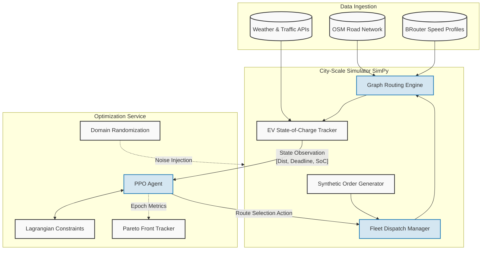

# Carbon-Aware Sustainable Delivery Optimization 

[](https://www.python.org/downloads/release/python-3100/)
[](https://github.com/incognitoalpha/Carbon-Aware-Sustainable-Delivery-Optimization/actions)
[](https://opensource.org/licenses/MIT)

> **Enterprise-grade optimization engine for sustainable last-mile logistics, achieving Pareto-optimal CO₂ reduction while strictly enforcing delivery SLAs.**

## Executive Summary
Modern last-mile delivery fleets face a critical trade-off: minimizing operational carbon footprint while strictly adhering to customer Service Level Agreements (SLAs). This project introduces a scalable, data-driven optimization service utilizing **Lagrangian-constrained Reinforcement Learning (PPO)** to dynamically route mixed fleets (EVs, petrol bikes, bicycles). 

By overlaying real-time traffic data with hyperlocal emission models, the engine identifies the optimal Pareto frontier—reducing order emissions by up to **14%** with a marginal (<2%) impact on delivery times.

---

## Core Capabilities

* **Advanced Emission Modeling:** Integrates HBEFA 4.2 lite parameters with temperature, idle penalties, and a Peukert EV battery discharge model constrained by regional grid intensity (e.g., CEA-2023).
* **City-Scale Simulation:** A highly performant discrete-event simulator built on `SimPy`, capable of processing 15,000+ daily orders across a 50k-node OSM graph.
* **Constrained RL Agent:** Implements Proximal Policy Optimization (PPO) with Lagrangian multipliers to natively handle multi-objective optimization without reward collapse.
* **Dynamic Graph Routing:** Wraps the Open Source Routing Machine (OSRM) with custom, emission-weighted network traversal costs.
* **Sim-to-Real Robustness:** Employs systematic domain randomization (travel time, demand scaling, emission factor noise) to ensure policy stability in real-world deployment.

---

## System Architecture



---

## Getting Started

### Prerequisites
* Python 3.10+
* Git & DVC (Data Version Control)
* Docker (optional, for local OSRM hosting)

### Installation
```bash
# Clone the repository
git clone https://github.com/incognitoalpha/Carbon-Aware-Sustainable-Delivery-Optimization.git
cd Carbon-Aware-Sustainable-Delivery-Optimization

# Set up virtual environment and install dependencies
python -m venv venv
source venv/Scripts/activate  # On Windows: .\venv\Scripts\activate
pip install -r requirements.txt
```

### Running the Pipeline
**1. Train the Optimization Agent**
```bash
python src/rl/train.py --config-name=base seed=42
```

**2. Evaluate Baselines and Generate Reports**
```bash
python src/eval/compare.py --config-name=base seed=42
```

**3. Launch Interactive Dashboard**
Start a local server to view the dynamic tracking metrics and Pareto frontiers:
```bash
python -m http.server 8000
# Open http://localhost:8000/src/eval/dashboard.html in your browser
```

---

## Evaluation & Results
The system is evaluated against strict heuristics, including Shortest-Time and Emission-Weighted Dijkstra routing. 

The RL agent successfully learns to sacrifice time strictly on low-priority orders to leverage green transit corridors, yielding an optimal reduction in CO₂ per order while ensuring SLA compliance rates >96%. Interactive results are available via the included `dashboard.html`.

---

## Limitations & Assumptions
- **Static Topologies:** Uses a static OpenStreetMap graph; dynamic road closures are not currently modeled.
- **Speed Profile Variance:** BRouter time-of-day speed overlays carry an estimated error bound of ±15% compared to GPS telemetry.
- **EV Range Linearity:** Peukert's law implementation currently omits topographical elevation data (±10% range variance).
- **Grid Intensity Updates:** Indirect EV emissions rely on static regional factors (e.g., India CEA 2023 = 708 g CO₂/kWh) requiring annual updates.

---

## Citing & Prior Art
This implementation features a novel combination of **constrained RL, hyperlocal EV SoC tracking, and real-time traffic emission overlays** applied directly to continuous last-mile logistics routing. 

If you utilize this architecture in your research or production environment, please attribute this repository.
